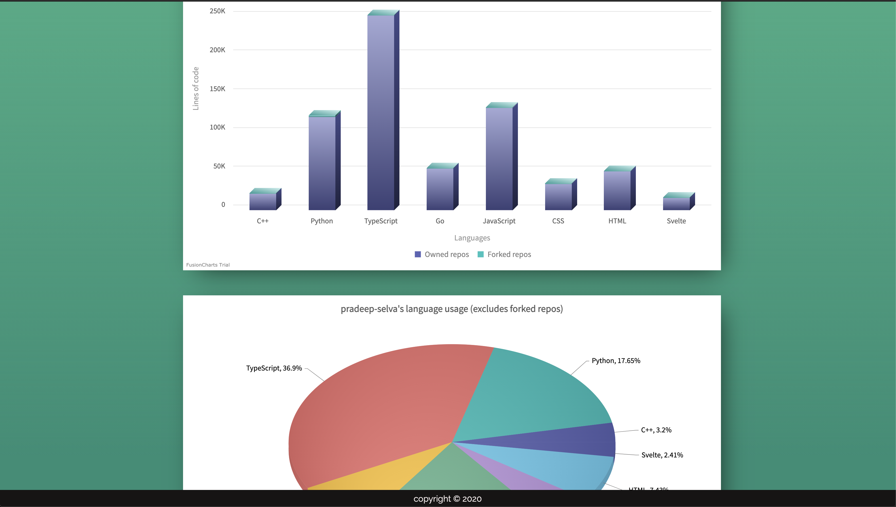

# Github Language Visualizer

- A website to see the statistics of languages used in your github repositories. Just enter and search for your github username!
- Enter your github username and view your basic github profile info and a detailed graphical report of your language usage overall through your repositories.
- View a top 3 language report, a stacked chart showing ratio between language used in forked and owned repositories and a pie chart showing language usage distribution in owned repositories.
- [Visit site](https://github-language-visualizer.web.app) to see it in action.

## Build using

- Svelte
- Typescript
- Javascript
- Github API

## Steps to run locally

- Clone the repo and install dependencies with `npm install` (or) `yarn`
- Create a file named `secrets.ts` in src directory and export a constant named `GITHUB_TOKEN` containing your github authentication key.
- Run `npm run dev` and go to `localhost:5000`

## Screenshots

---

## License

[MIT](LICENSE) © [Pradeep-selva](https://github.com/Pradeep-selva)
